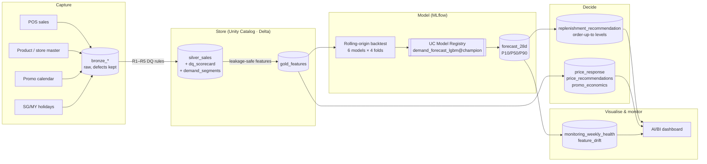

# Retail Demand Intelligence on Databricks
**Demand forecasting → inventory optimisation → pricing & promo analytics → monitoring**, built end to end on the Databricks Lakehouse (Unity Catalog, Delta, MLflow, Spark `applyInPandas`, Jobs).

> A regional retailer (10 stores × 40 SKUs, SG/MY calendar) replenishes stock with an Excel rule: *"keep 14 days of cover at the last-4-week average."* Stores run out during promos and 11.11/12.12, and carry excess slow-moving stock the rest of the year. This project replaces that rule with a validated forecast and measures the result in **dollars, not just accuracy**.

---

## Before vs After (backtested, 4 folds × 28 days, Sep–Dec 2025)

| KPI | Current state (Excel rule) | Future state (this project) | Change |
|---|---|---|---|
| Forecast error, weekly store-SKU **WAPE** | 31.2% | **13.0%** | **−58%** |
| Forecast **bias** (weekly) | +3.4% (over-forecasting) | +0.5% | near-unbiased |
| **VN1 score** (WAPE + \|bias\|) | 0.346 | **0.135** | −61% |
| Promo-day WAPE (daily) | 54.4% | **20.2%** | −63% |
| **Fill rate** (95% service-level policy) | 93.5% | **98.7%** | +5.2 pts |
| **Average inventory value** | $163k | **$112k** | **−32% working capital** |
| **Lost margin from stock-outs**, annualised | $241k | **$53k** | **−78%** |
| Stock-out store-SKU-days | 4.0% | 1.6% | −61% |
| Loss-making promo mechanics identified | not measured | **12 of 20** depth × category combinations | stop or re-fund them |

*These are simulated results on synthetic data (see [Limitations](#limitations--what-id-do-with-real-data)). The method is what transfers to real data: the same folds, the same metrics, and the same demand for both policies.*

---

## Architecture: the data pipeline view



| Notebook | What it does | Main output tables |
|---|---|---|
| `00_config` | widgets, UC schema, shared helpers | – |
| `01_bronze_ingest` | lands raw data *with* defects (synthetic generator or VN1 CSVs) | `bronze_sales`, `bronze_products`, `bronze_stores`, … |
| `02_silver_quality_eda` | 5 DQ rules, censored-demand handling, EDA, ADI/CV² segmentation | `silver_sales`, `dq_scorecard`, `demand_segments` |
| `03_gold_features` | 32 leakage-safe features (lags ≥ horizon, price/promo, calendar) + leakage guard | `gold_features` |
| `04_forecast_backtest_mlflow` | 6 models, 4-fold backtest, WAPE/MAPE/bias/VN1 at 3 grains, MLflow tracking, UC registration, 28-day scoring | `backtest_*`, `forecast_28d` |
| `05_inventory_optimization` | (R,S) policy simulation, service-vs-capital frontier, next-week order-up-to | `inventory_*`, `replenishment_recommendation` |
| `06_pricing_promo_analytics` | Poisson GLM elasticity/uplift/cannibalisation, **validated against ground truth**, promo ROI, price recommendations | `price_response`, `promo_economics`, `price_recommendations` |
| `07_monitoring_business_impact` | accuracy & bias alerts, PSI drift, executive Before/After table | `monitoring_*`, `exec_summary` |

The reusable logic lives in `src/retail_ds/` (unit-tested). The notebooks tell the story; the package contains the framework.

---

## Key findings (the story for a business audience)

1. **The biggest win is on promotions.** On promo days the Excel rule misses by 54% because it cannot see a planned promo coming. The model treats the promo plan as a known future input and cuts the miss to 20%. Promo stock-outs are the most expensive lost sales.
2. **Not every SKU can be forecast well, and that is fine.** 140 of 400 series are intermittent or lumpy. Every method scores VN1 ≈ 1.5–2.0 on them at the daily grain, so a better model is not the lever there. Manage them with safety stock and weekly aggregation, and set expectations honestly.
3. **Accuracy gains become cash through the inventory policy.** At a 95% target, the forecast-driven policy carries **32% less stock *and*** serves more customers. The current rule sits off the efficient frontier, so no trade-off is needed to beat it.
4. **Deep discounts buy volume, not profit.** Beverages promos pay up to ~25% off. In Personal Care, even 10% off only breaks even once cannibalisation of sibling SKUs is counted.
5. **Check an estimator before trusting it.** A naive elasticity model said Snacks was nearly inelastic (−1.08). The truth is −1.79. SKU trends correlated with price inflation had leaked into the price coefficient. Controlling for them gives −1.62. ➡️ Use model elasticities to *shortlist* price moves, then A/B test them.

### Price/promo estimator validation (synthetic data has a known truth)
| Category | Naive elasticity | Controlled elasticity [95% CI] | **True** | Promo uplift est. / true | Cannibalisation est. / true |
|---|---|---|---|---|---|
| Beverages | −1.93 | −2.29 [−2.40, −2.18] | −2.18 | 1.79 / 1.90 | 2.1% / 2.5% |
| Snacks | **−1.08** | −1.62 [−1.71, −1.54] | −1.79 | 1.74 / 1.70 | 3.2% / 2.5% |
| Household | −1.17 | −1.16 [−1.25, −1.08] | −1.32 | 1.46 / 1.45 | 2.3% / 2.5% |
| Personal Care | −1.03 | −1.02 [−1.12, −0.92] | −1.07 | 1.47 / 1.42 | 2.5% / 2.5% |

---

## JD → project mapping (Digital Place Vision, Senior Data Scientist)

| JD requirement | Where it is demonstrated |
|---|---|
| Demand forecasting, inventory optimisation, replenishment, pricing, promotion analytics | Notebooks 04, 05, 06 |
| Deep EDA, feature engineering, experimentation | 02 (DQ + segmentation + EDA), 03 (32 features, leakage guard), 04 (6-model experiment) |
| Trade-offs between accuracy, speed, scalability, business constraints | Direct vs recursive design (03), ETS routed to Croston for intermittent series (04), ±10% price guardrail (06), `applyInPandas` scale-out (04) |
| **WAPE, MAPE, VN1, bias, service levels**, backtesting | `metrics.py`; 4-fold rolling-origin backtest scored at daily, weekly-SKU and weekly-category grains; fill rate and cycle service level (05) |
| Research → production: data requirements, feature logic, validation rules, post-deployment monitoring | DQ rules R1–R5 + scorecard (02), pyfunc wrapper + UC registry `@champion` (04), weekly health + PSI (07), Databricks Asset Bundle job |
| Communicate to technical and non-technical stakeholders | Markdown narrative in every notebook, `exec_summary` table, dashboard queries |
| Best practices, reusable frameworks, mentoring juniors | `src/retail_ds` package, 12 unit tests, a notebook smoke-test harness, a documented model contract |
| Python, Pandas, NumPy, SciPy, Scikit-learn, Statsmodels, SQL, cloud, ML tooling | All used; LightGBM, MLflow, Spark, Unity Catalog, Delta |

---

## Run it on Databricks (Free Edition works)

**Option A: UI, about 15 minutes**
1. Sign up for [Databricks Free Edition](https://www.databricks.com/learn/free-edition).
2. Push this folder to a GitHub repo. In Databricks, go to **Workspace → Create → Git folder** and paste the repo URL.
3. Open `notebooks/01_bronze_ingest` and run it, then 02 → 07 in order on serverless compute. Each notebook runs `00_config` itself.
   Default target: `workspace.retail_ds`. Change it with the `catalog` / `schema` widgets.
4. Optional: build an **AI/BI dashboard** from `dashboards/queries.sql`.

**Option B: Asset Bundle (CLI)**
```bash
databricks auth login --host <your-workspace-url>
databricks bundle validate
databricks bundle deploy -t dev
databricks bundle run retail_demand_pipeline -t dev
```
The job runs bronze → silver → gold → forecast → (inventory ‖ pricing) → monitoring on serverless compute, with a weekly schedule (paused by default).

**Local (no Spark)**
```bash
pip install -r requirements.txt
pytest -q tests                        # 12 unit tests
python scripts/run_local.py            # whole pipeline in pandas, ~4 min, writes outputs/
python scripts/notebook_smoke_test.py  # executes the actual notebooks with Spark/dbutils shims
```
`outputs/` contains the results from the reference run quoted in this README.

---

## Design decisions (interview talking points)

| Decision | Alternative | Why |
|---|---|---|
| **One global LightGBM** (Tweedie loss) | 400 per-series models | Learns promo and holiday response *across* series, since a single short series has too few promos to learn from. One training job. Tweedie suits zero-inflated counts. |
| **Direct forecasting, lags ≥ 28** | Recursive | No error compounding and one model, at a small cost to day 1–7 accuracy. That suits weekly batch replenishment. |
| **Stock-out days masked from target and scoring** | Train on raw sales | Sales on a stock-out day are *censored* demand. Training on them under-forecasts, which causes more stock-outs: a self-fulfilling loop. |
| **Select the model on weekly VN1**, not daily MAPE | Daily MAPE | Replenishment is decided weekly. MAPE is undefined at zero and penalises slow movers. VN1 punishes bias, which is what drives inventory cost. |
| **Segment first (ADI/CV²)** | One method everywhere | Routes ETS away from intermittent series and sets honest accuracy expectations per segment. |
| **Calibrate σ on fold 1, simulate on folds 2–4** | Calibrate and test on the same data | Otherwise the safety stock "knows" the test errors and the saving is overstated. |
| **Poisson GLM + SKU trends** for elasticity | log-OLS | Handles zero sales. The trend control removes the inflation confound (shown above). |
| **pyfunc wrapper** handles category encoding | Raw LightGBM artifact | Engineers score with plain strings, and the feature contract lives with the model. |

## Limitations & what I'd do with real data
- **Synthetic data flatters ML.** The generator's structure matches the features. On real data (M5, VN1 or client POS), expect a smaller gap over the baseline. The *framework* is the deliverable here, not the 58%.
- Inventory simulation: lost sales only, no shelf/MOQ/case-pack constraints, and forecasts per review day come from the backtest fold. Next steps: MOQ and pack rounding, and DC capacity as an LP (`scipy.optimize.linprog` / OR-Tools).
- Promo economics ignore post-promo dips (pantry loading), cross-category halo effects and vendor funding.
- Elasticity CIs do not always cover the truth, so some residual confounding remains. That is why A/B testing is the recommendation.
- The `vn1` source in notebook 01 only lands the data. Downstream notebooks assume daily data with price and promo fields.

## Repo structure
```
├── databricks.yml                  # Asset Bundle: 7-task serverless job
├── notebooks/                      # 00_config … 07_monitoring (Databricks .py source format)
├── src/retail_ds/                  # reusable framework
│   ├── data_gen.py   cleaning.py   features.py   models.py
│   ├── backtest.py   metrics.py    inventory.py  pricing.py   monitoring.py
├── tests/test_retail_ds.py         # metrics, leakage guards, simulation invariants, pricing
├── scripts/run_local.py            # pandas end-to-end run
├── scripts/notebook_smoke_test.py  # runs the notebooks locally with shims
├── dashboards/queries.sql          # AI/BI dashboard datasets
└── outputs/                        # reference-run results
```
